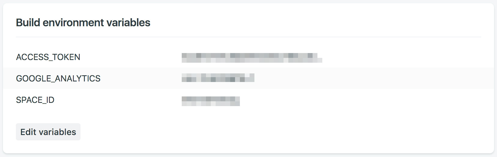
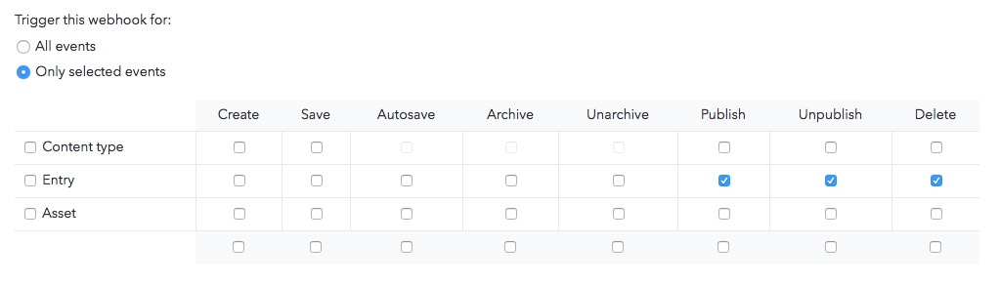
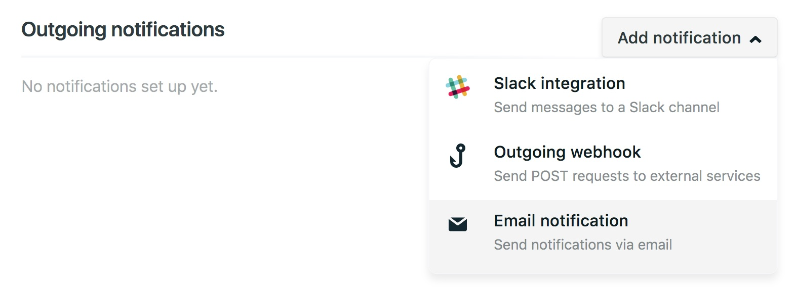

[](https://app.netlify.com/sites/medicare-for-all-pdx/deploys)

# Medicare for All Portland

Our requirements: inexpensive, performant, custom, accessible, and easy to update. This is an attempt to satisfy those requirements and eventually move towards a web template for social movement organizations to use to quickly spin up a website that their comms teams can maintain with minimal IT infrastructure and support.

We want content -- event information, blog posts, informational pages (home, about, etc) -- to be routinely edited and published by non-developer users. How do we achieve this?

This site is designed with the [Gatsby](https://github.com/gatsbyjs/gatsby) static site generator. At build time, Gatsby sources content from [Contentful](https://www.contentful.com/) CMS. A build to [Netlify](https://www.netlify.com/) is triggered when a new commit is made on this repository's main branch, or when new content is published on the associated Contentful space.

We also want responses from the contact form to be accessible to the least-technical of users (aka no databases, no airtable, etc). To that end, this site uses a Netlify Functions backend to receive form submissions and append them as a new row in a Google Sheets spreadsheet.

## Demo

https://medicare-for-all-pdx.netlify.app/


## Getting Started

### Prerequisites
1. `git`
    - [Installation instructions](https://github.com/git-guides/install-git)
2. `node` and `npm`. I  prefer installing via `nvm` rather than through your OS' package manager or a downloaded bundle. Much easier to manage target versions and updates.
    - [Installing nvm](https://github.com/nvm-sh/nvm#installing-and-updating)
    - Install node and npm: `nvm install node`

3. `yarn`
    - `npm install --global yarn`

4. `netlify`
    - `npm install --global netlify-cli`


### Install Dependencies

```
git clone https://github.com/thejkayway/m4apdx.git && cd m4apdx
yarn install
```

### Setup Contentful

1.  Copy [`./.contentful.json.sample`](https://github.com/thejkayway/m4apdx/blob/master/.contentful.json.sample) to `./.contentful.json`

2.  Replace `spaceId` and `accessToken` for development and production environments. Info for your Contentful space can be found here: **app.contentful.com** → **Space Settings** → **API keys**.

### Setup Form Response Storage

1. [Create a new Google sheet](https://docs.google.com/spreadsheets/u/0/create) to store form responses while testing. Note the sheet ID in the URL (`https://docs.google.com/spreadsheets/d/${SHEET_ID}`).

2. Follow the instructions [here](https://theoephraim.github.io/node-google-spreadsheet/#/getting-started/authentication?id=service-account) to create a service account with permission to edit your sheet. Note the `client_email` and `private_key` in the file generated from that process.

3. Copy [`./.netlify.json.sample`](https://github.com/thejkayway/m4apdx/blob/master/.netlify.json.sample) to `./.netlify.json`

4. Fill in values for `GOOGLE_SHEET_ID`, `GOOGLE_SERVICE_ACCOUNT_EMAIL`, and `GOOGLE_PRIVATE_KEY`. 
    - Sheet ID can be found in the URL of the sheet from step 1 above.
    - Service account email and and private key come from `client_email` and `private_key` in step 2 above.

### Run Site Locally
`yarn develop`

## How is this site structured?

Ignoring all the fancy build-time features that gatsby brings in, this is just a static react site. Components are stored in `src/components/`. Styling is done with template strings inside our components via [@emotion/styled](https://emotion.sh/docs/styled). Theme variables are provided to our styles by [gatsby-plugin-theme-ui](https://theme-ui.com/packages/gatsby-plugin/). Theme variables are defined in `src/gatsby-plugin-theme-ui/index.js`, the object exported there is available in our components via `${props => props.theme}`.

Backend code is run via Netlify Functions (aka Netlify managed AWS Lambda). This means that you can create a javascript file in `netlify/functions` that exports a function called `handler` and Netlify will handle 

### That Fancy Build Time Stuff

When building the site (`yarn develop` or `yarn build`), gatsby runs any function exported from `gatsby-node.js` that implements one of its [APIs](https://www.gatsbyjs.com/docs/reference/config-files/gatsby-node/#apis). For our purposes `src/gatsby/node/createPages.js` does all the heavy lifting.

That function creates all of the actual pages that make up our site through repeatedly calling gatsby's "createPage" helper function with a URL path for the page, a page template component, and miscellaneous context variables to help the template component fill itself out.

Template components are defined in `src/templates`. They export two things:
- a React component that uses our UI components from `src/components` to create a complete page
- a graphql query which populates the `data` variable in the template component's input

### 

## Customization

### Website Data

Edit siteMeta data in [`/src/gatsby-config.js`](https://github.com/thejkayway/m4apdx/blob/master/src/gatsby-config.js)

```js
  siteMetadata: {
    title: 'Title', // Title of the website
    description: // Description of the website
      'A starter template to build amazing static websites with Gatsby, Contentful and Netlify',
    siteUrl: 'https://url.netlify.com', // Website URL. Do not include trailing slash
    image: '/images/share.png', // Path to default image for SEO
    menuLinks: [ // The links used in the top menu
      {
        name: 'Home',
        slug: '/',
      },
      {
        name: 'About',
        slug: '/about/',
      },
      {
        name: 'Contact',
        slug: '/contact/',
      },
    ],
    postsPerFirstPage: 7, // Number of posts on the first page of blogs and events
    postsPerPage: 6, // Number of posts used on all other pages of blogs and events
    /*
      Root URL for posts and tags
      For example: 'blog' will result in:
        - www.example.com/blog/
        - www.example.com/blog/post-name/
        - www.example.com/blog/tag/tag-name/
    */
    blogBasePath: '/', // Defaults to the homepage
  }
```

**Note:** If you do not see your changes reflected when developing locally you may need to run `yarn clean` followed by restarting the server via `yarn develop`.

### Theme UI

Edit [`/src/gatsby-plugin-theme-ui/index.js`](https://github.com/thejkayway/m4apdx/blob/master/src/gatsby-plugin-them-ui/index.js)


### Using Gatsby Standard Linter Config

1.  Quickly check your code for errors with the `yarn test` script
2.  You can view the [Gatsby Standard README](https://github.com/brandonkal/eslint-config-gatsby-standard) for details on how to integrate this project's included Gatsby Standard, Stylelint, and Prettier modules into your text editor

### Content and SEO

1.  You can replace the `share.png` and `favicon.png` files in the `static/images` directory.
2.  Meta descriptions are defined in Contentful. If you choose to leave this field blank on new posts a 320 character excerpt of the post/page will be used instead.

## Deployment

### Netlify Deployment From Git

1.  [New Netlify website from Git](https://app.netlify.com/start)

2.  Connect with GitHub and select your repo

3.  Navigate to Netlify: **Settings** → **Build & Deploy** → **Build Environment Variables**. Add the following environment variables (the variables must be named exactly like this in order to work properly):

```
ACCESS_TOKEN                   Contentful Content Delivery API Access Token
SPACE_ID                       Contentful Space ID
GOOGLE_SHEET_ID                See "Setup Form Response Storage" above
GOOGLE_SERVICE_ACCOUNT_EMAIL   See "Setup Form Response Storage" above
GOOGLE_PRIVATE_KEY             See "Setup Form Response Storage" above
GOOGLE_ANALYTICS               (optional)
```



4.  Navigate to Netlify: **Deploys**. Click `Trigger deploy` to manually trigger a deploy to confirm the website is building successfully using your build environment variables. At this point be aware that every time you push to `main` a deploy will automatically start and be published to production.

## Additional Settings

### Contentful Webhook (Optional)

1.  Navigate to Netlify:
    **Settings** → **Build & Deploy** → **Build hooks**.
    Create a new build hook.

2.  Navigate to Contentful:
    **app.contentful.com** → **Space Settings** → **Webhooks**. Create a webhook using the Netlify build URL that you just created
    and configure which events should trigger the build on production. For example the following will rebuild the production website every time a post or page is published, unpublished or deleted:



### Netlify Form Notifications (Optional)

1.  Navigate to Netlify:
    **Forms** → **Notifications**

2.  Click the add notification dropdown and select your desired notification method.



## Useful Tips

- If you make edits to your Contentful space while running `yarn develop` you will need to stop it and rerun the command to see the changes reflected. For example a new post or page will not automatically show up until the website has been rebuilt.
- **DO NOT** store your Contentful access tokens or space ids anywhere in GitHub. Treat them like passwords.
